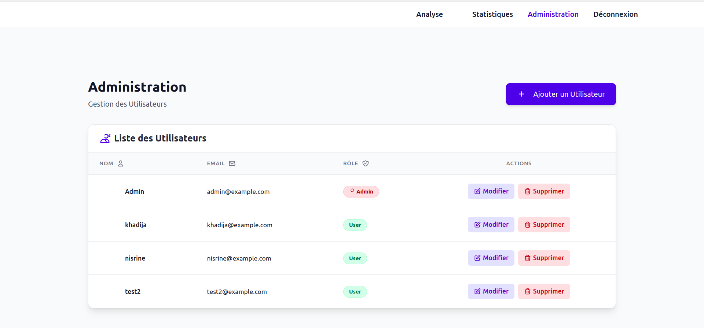
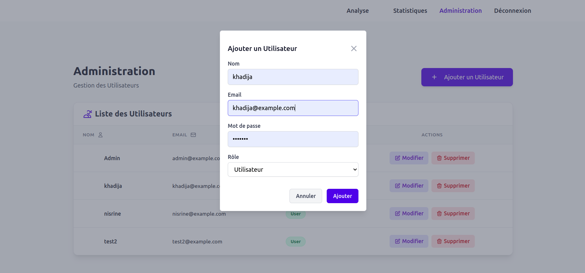
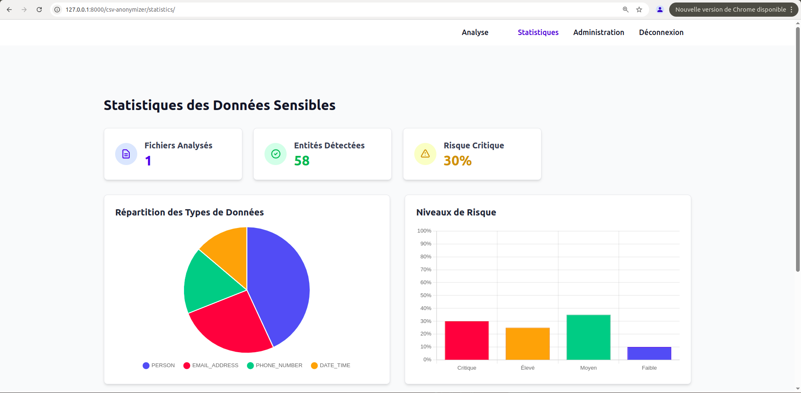

# Automatic Sensitive Data Detection

Application Django pour la détection et l'anonymisation automatique de données sensibles dans les fichiers CSV, utilisant **Presidio** et **spaCy**.

---

##  Prérequis

- Docker et Docker Compose  
- Git  

---

##  Installation et Démarrage

### 1. Cloner le repository

```bash
git clone https://github.com/khadijatarhri/automatic-Sensitive-Data-Detection.git  
cd automatic-Sensitive-Data-Detection
```
### 2. Lancer l'application avec Docker
```bash
sudo docker-compose up --build
```
### 3. Créer l'utilisateur administrateur  
Dans un nouveau terminal, exécutez :

```bash
sudo docker exec -it sensitive-data-detection-web-1 python create_admin.py
```
### 4. Accéder à l'application
Ouvrez votre navigateur et allez à :
http://127.0.0.1:8000/login

### 5. Se connecter
Utilisez les identifiants par défaut :

Email : admin@example.com

Mot de passe : admin123

##  Architecture

L'application utilise :

Django : Framework web backend 

MongoDB : Base de données pour les utilisateurs et données CSV

Presidio : Moteur de détection et d’anonymisation

spaCy : Modèle de traitement du langage naturel (en_core_web_sm)

Tailwind CSS : Framework CSS pour l’interface

##  Fonctionnalités
Authentification : Système de login/register avec sessions 

Upload CSV : Interface pour télécharger des fichiers CSV

Détection PII : Identification automatique des données personnelles

Anonymisation : Remplacement des données sensibles

Interface responsive : Design moderne avec thème sombre/clair

##  Structure du Projet
```bash
├── authapp/              # Système d'authentification  
├── csv_anonymizer/       # Logique d'anonymisation  
├── backend_with_mongodb/ # Configuration Django  
├── theme/                # Thème Tailwind CSS  
├── api/                  # API REST  
├── mongo_auth/           # Authentification MongoDB  
├── docker-compose.yml    # Configuration Docker  
├── Dockerfile            # Image Docker  
├── requirements.txt      # Dépendances Python  
└── create_admin.py       # Script création admin
```
##  Arrêter l'application
```bash
sudo docker-compose down
```
##  Développement
Pour le développement local, vous pouvez modifier les fichiers et relancer :

```bash
sudo docker-compose up --build
```


##  Aperçu de l'application


### Login : Connexion à la plateforme.


### Téléversement : Upload de fichiers CSV ou TXT à analyser.


### Statistiques : Affichage des entités sensibles détectées sous forme de graphiques.


### Administration : Gestion des utilisateurs (ajout, modification, suppression).




### Statistiques globales : Vue d’ensemble des entités détectées.



### Interface utilisateur simple : Accès uniquement aux fichiers anonymisés.


## 📄 Licence
Ce projet est sous licence MIT.
